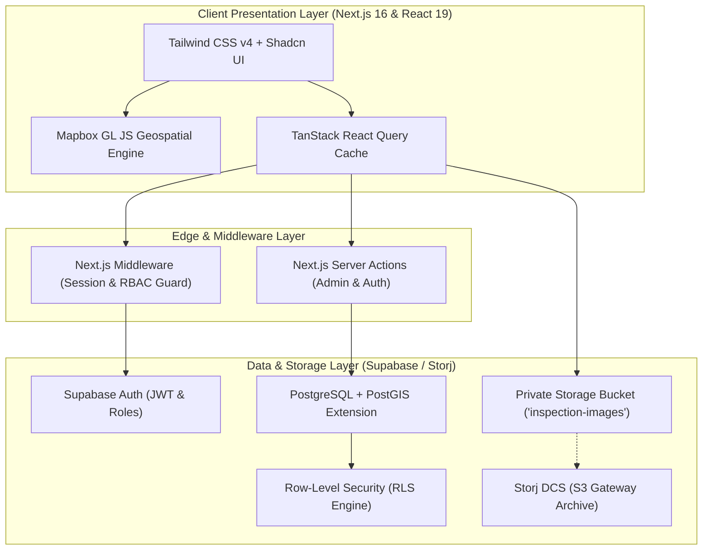

# 🏢 EPROPVIEW — Enterprise Geospatial Property & Risk Intelligence Platform

<div align="center">


**A next-generation structural inspection, environmental hazard assessment, and real-time geospatial property intelligence platform designed for engineering teams, safety inspectors, and municipal asset managers.**

[System Architecture](#-system-architecture) • [Key Features](#-key-features) • [Tech Stack](#-technology-stack) • [Quick Start](#-quick-start) • [Database & Migrations](#-database--migrations) • [RBAC Security](#-role-based-access-control-rbac) • [Client Handoff Plan](#-client-handoff--migration)

</div>

---

## 🌟 Executive Overview

**EPROPVIEW** transforms complex structural and environmental data into actionable geospatial intelligence. Built on Next.js 16 App Router, React 19, and Supabase PostGIS, the platform enables engineering teams and safety auditors to conduct high-fidelity site inspections, track structural damage trends, evaluate seismic and liquefaction vulnerabilities, and manage compliance reporting through a unified, collaborative control plane.

### Core Value Propositions
* 🌐 **Geospatial Precision**: Native PostGIS integration for spatial hazard boundary modeling, fault line proximity analysis, and dynamic risk hotspot coordinate mapping.
* 🛡️ **Zero-Trust Security**: Multi-tiered Role-Based Access Control (RBAC) enforced via PostgreSQL Row-Level Security (RLS) policies and Next.js Edge Middleware.
* 🗄️ **Private Asset Vault**: Secure multi-media storage utilizing time-bound signed URLs, image audit trails, and collaborative commenting threads.
* 📊 **Predictive Risk Modeling**: Composite environmental scoring combining soil liquefaction zones, fault line proximity, and historical erosion metrics.
* 📄 **Audit-Ready Compliance**: Multi-signer report authoring workflows with immutable timestamps and print-ready PDF export layouts.

---

## 🏗️ System Architecture



---

## ✨ Key Features

### 1. 🗺️ Interactive Geospatial Dashboard
* **Mapbox GL Integration**: Real-time vector tiles, 3D building models, satellite terrain layers, and interactive hazard heatmaps.
* **Risk Hotspot Visualizer**: Spatial point rendering with customizable severity markers (Critical, Moderate, Low) linked directly to maintenance priority queues.
* **Live KPI Counters**: Instant metric aggregation for active inspections, critical vulnerabilities, and reports awaiting sign-off via database-level RPC stored procedures.

### 2. 🗄️ Secure Asset Vault & Photo Commenting
* **Private Bucket Isolation**: Inspection images are stored in private storage buckets and served exclusively through short-lived cryptographic signed URLs.
* **In-Feed Annotation & Comments**: Real-time discussion threads attached directly to individual photographic evidence items.
* **Automated Notification Badging**: Unread comment indicators dynamically updated for active inspectors and supervising engineers.

### 3. 🌋 Environmental Risk & Hazard Modeling
* **Seismic Fault Line Proximity**: Geodesic distance calculation to active tectonic faults with 5-tier classification (`none` to `very_high`).
* **Soil Liquefaction Zonation**: Multi-polygon spatial mapping (`zone_a`, `zone_b`, `zone_c`) overlaying municipal zoning districts.
* **Erosion Vulnerability Engine**: Multi-factorial risk synthesis generating normalized 0–10 risk indices.

### 4. 📄 Compliance Reports & Audit Trail
* **Lifecycle Workflow**: Structured transitions through `open` ➔ `in_review` ➔ `critical` ➔ `completed`.
* **Multi-Signer Provenance**: Full audit logging tracking `created_by`, `last_edited_by`, `reviewed_by`, and respective ISO timestamps.
* **Print & Export Layout**: Dedicated CSS media query styling optimized for official PDF document generation and paper audits.

### 5. 👥 Administrative RBAC & User Management
* **Role Hierarchy**: Strict permission partitioning between **Admin**, **Inspector**, and **Viewer** roles.
* **Inspector Provisioning**: Administrative console to create, invite, activate, or deactivate inspection personnel.
* **Legacy Migration Utility**: Built-in CLI and API data migrator bridging legacy SQLite/Django backends into Supabase PostgreSQL.

---

## 🛠️ Technology Stack

| Domain | Technology / Library | Version | Description |
| :--- | :--- | :--- | :--- |
| **Framework** | [Next.js (App Router)](https://nextjs.org/) | `16.2.6` | React Server Components, Server Actions, Edge Middleware |
| **UI Library** | [React](https://react.dev/) | `19.2.4` | Modern component architecture and concurrent features |
| **Styling** | [Tailwind CSS](https://tailwindcss.com/) | `v4.0` | Next-generation zero-config CSS framework |
| **Database** | [PostgreSQL + PostGIS](https://supabase.com/) | `15+` | Spatial database engine with geometry types |
| **Auth & Storage** | [Supabase](https://supabase.com/) | `@supabase/ssr ^0.10` | JWT authentication, RLS policies, and private bucket storage |
| **Decentralized Storage** | [Storj DCS](https://www.storj.io/) | `S3 Gateway` | Zero-knowledge encrypted decentralized object archive |
| **Mapping Engine** | [Mapbox GL JS](https://www.mapbox.com/) | `3.20.0` | Geospatial mapping, vector tiles, and hazard overlays |
| **State Management** | [TanStack React Query](https://tanstack.com/query) | `^5.100` | Async server-state management and query caching |
| **Data Visualization** | [Chart.js](https://www.chartjs.org/) & [react-chartjs-2](https://react-chartjs-2.js.org/) | `^4.5` | Dynamic damage trend graphs and severity breakdown charts |
| **Type Safety** | [TypeScript](https://www.typescriptlang.org/) & [Zod](https://zod.dev/) | `^5.0` / `^4.4` | End-to-end type validation and runtime schema safety |

---

## 📂 Repository Directory Structure

```text
EPROPVIEW/
├── docs/                           # Official Technical Documentation & Handoff Plans
│   ├── ACCOUNT_MIGRATION_PLAN.docx # Comprehensive client account migration guide (Word format)
│   ├── STORAGE_FIX.md              # Supabase Storage RLS & bucket initialization manual
│   └── superpowers/                # Architecture specifications & rebuild roadmap
├── public/                         # Static web assets, favicons, and branding
├── src/
│   ├── app/                        # Next.js App Router root
│   │   ├── (dashboard)/            # Authenticated layout group
│   │   │   ├── dashboard/          # Analytics overview, map canvas, trend charts
│   │   │   ├── document/           # Asset Vault, image uploader, commenting threads
│   │   │   ├── environmental/      # PostGIS risk analysis, liquefaction polygons
│   │   │   ├── projects/           # Geospatial project catalog and status filters
│   │   │   ├── reports/            # Compliance reports authoring, audit log, PDF export
│   │   │   └── settings/           # Admin user management and inspector provisioning
│   │   ├── actions/                # Server Actions (Auth, User Admin, Session management)
│   │   ├── api/                    # RESTful endpoint handlers (Data migration pipeline)
│   │   ├── lib/                    # Core business logic, queries, mutations, Supabase clients
│   │   │   ├── dal.ts              # Data Access Layer & role validation
│   │   │   ├── migrate.ts          # Automated SQLite-to-Supabase migration engine
│   │   │   ├── mutations.ts        # React Query mutation hooks
│   │   │   ├── queries.ts          # React Query data fetching hooks & signed URL mappers
│   │   │   └── supabase/           # SSR Browser, Server, and Middleware clients
│   │   ├── login/                  # Enterprise login portal
│   │   └── types/                  # Global TypeScript type definitions and interfaces
│   ├── components/                 # Modular UI Components
│   │   ├── auth/                   # Authentication forms and password handlers
│   │   ├── dashboard/              # Mapbox canvas, KPI cards, damage trend charts
│   │   ├── document/               # Asset feed, camera capture, comment threads
│   │   ├── environmental/          # PostGIS analysis panels, risk gauges
│   │   ├── reports/                # Report forms, review modals, printable view
│   │   ├── settings/               # Inspector creation modals, user status tables
│   │   ├── shared/                 # Navbar, Sidebar, status badges, risk score pill
│   │   └── ui/                     # Base UI design system primitives
│   └── scripts/                    # CLI execution utilities (Database migration runner)
├── supabase/
│   └── migrations/                 # PostgreSQL & PostGIS migration scripts (001 - 005)
├── .env.example                    # Master environment variables template
├── middleware.ts                   # Next.js Edge authentication and RBAC routing guard
├── next.config.ts                  # Next.js security headers & image domain rules
├── package.json                    # Project dependencies and operational scripts
└── tsconfig.json                   # Strict TypeScript compiler configuration
```

---

## 🚀 Quick Start & Installation

### 1. Prerequisites
* **Node.js**: `v20.x` or `v22.x` (LTS recommended)
* **Package Manager**: `npm` (v10+), `pnpm`, or `bun`
* **Cloud Accounts**: Supabase (PostgreSQL with PostGIS) & Mapbox (Public Access Token)

### 2. Clone and Install Dependencies
```bash
# Clone the repository
git clone https://github.com/[YourOrg]/eprop-view.git
cd eprop-view

# Install dependencies
npm install
```

### 3. Environment Variables Configuration
Copy the sample environment template and populate your credentials:

```bash
cp .env.example .env.local
```

Edit `.env.local` with your active service keys:

```env
# Supabase Configuration
NEXT_PUBLIC_SUPABASE_URL=https://your-project-id.supabase.co
NEXT_PUBLIC_SUPABASE_ANON_KEY=sb_publishable_your-anon-key
SUPABASE_SERVICE_ROLE_KEY=sb_secret_your-service-role-key

# Mapbox Geospatial Configuration
NEXT_PUBLIC_MAPBOX_ACCESS_TOKEN=pk.eyJ1IjoieW91ci11c2VybmFtZSIsImEiOiJ5b3VyLXRva2VuIn0...

# Application URL
NEXT_PUBLIC_SITE_URL=http://localhost:3000

# Legacy Data Migration Credentials (Optional)
MIGRATION_ADMIN_PASSWORD=your-secure-admin-password
MIGRATION_DEFAULT_PASSWORD=your-secure-inspector-password
```

### 4. Run the Development Server
```bash
npm run dev
```
Open [http://localhost:3000](http://localhost:3000) in your browser.

---

## 🗄️ Database Setup & Migrations

EPROPVIEW utilizes PostgreSQL 15+ hosted on Supabase, accelerated with the PostGIS spatial engine.

### Step 1: Enable PostGIS Extension
Run this command in the **Supabase SQL Editor**:
```sql
CREATE EXTENSION IF NOT EXISTS postgis SCHEMA extensions;
```

### Step 2: Apply Migration Scripts
Execute the SQL migration scripts in [`supabase/migrations/`](./supabase/migrations/) sequentially:

1. **`001_initial_schema.sql`**: Provisions tables (`profiles`, `projects`, `inspections`, `reports`, `environmental_risks`, `risk_hotspots`, `maintenance_priorities`, `damage_trends`, `geospatial_zones`), RPC functions (`get_dashboard_stats`, `create_report_with_id`), auth triggers, and baseline RLS policies.
2. **`002_add_user_status.sql`**: Appends the `is_active` boolean flag to the `profiles` table.
3. **`002_reports_audit_trail.sql`**: Introduces multi-user audit columns (`created_by`, `reviewed_by`, `last_edited_by`, `reviewed_at`, `last_edited_at`).
4. **`003_setup_storage.sql`**: Registers the `inspection-images` private storage bucket and applies storage RLS policies.
5. **`004_image_ownership.sql`**: Binds the `uploader_id` foreign key to `inspection_images`.
6. **`005_asset_commenting.sql`**: Deploys the `image_comments` discussion table and unread notification counter.

### Step 3: Run Data Migration (Optional)
To import historical datasets from a legacy SQLite database (`backend/db.sqlite3`):
```bash
npm run migrate
```

---

## 🛡️ Role-Based Access Control (RBAC)

The platform enforces three distinct user authorization tiers:

```text
┌─────────────────────────┬───────────────┬───────────────────┬────────────────┐
│ Privilege / Capability  │ Admin         │ Inspector         │ Viewer         │
├─────────────────────────┼───────────────┼───────────────────┼────────────────┤
│ View Dashboard & Maps   │  Full Access  │  Full Access      │  Full Access   │
│ Create Inspections      │  Full Access  │  Full Access      │  Read-Only     │
│ Upload Vault Imagery    │  Full Access  │  Full Access      │  Read-Only     │
│ Post Image Comments     │  Full Access  │  Full Access      │  Full Access   │
│ Author/Edit Reports     │  Full Access  │  Assigned Only    │  Read-Only     │
│ Review & Approve Reports│  Full Access  │  Assigned Only    │  Read-Only     │
│ Manage User Accounts    │  Full Access  │  Restricted (403) │  Restricted    │
│ Delete Projects/Assets  │  Full Access  │  Restricted (403) │  Restricted    │
└─────────────────────────┴───────────────┴───────────────────┴────────────────┘
```

---

## 📜 Available Scripts

| Command | Action |
| :--- | :--- |
| `npm run dev` | Launches the Next.js development server on port `3000` with hot reload. |
| `npm run build` | Compiles TypeScript, runs Next.js optimizations, and generates production bundles. |
| `npm run start` | Runs the compiled Next.js application in production mode. |
| `npm run lint` | Runs ESLint 9 to validate codebase syntax and Next.js best practices. |
| `npm run migrate` | Executes the automated SQLite-to-Supabase migration script via `tsx`. |

---

## 🤝 Client Handoff & Migration

For detailed, step-by-step technical instructions on transferring ownership of GitHub, Vercel, Supabase, Storj DCS, and Mapbox accounts to your organization, consult the official Word document in the repository:

📄 **[`docs/ACCOUNT_MIGRATION_PLAN.docx`](./docs/ACCOUNT_MIGRATION_PLAN.docx)**

The handoff guide includes:
* Detailed transfer procedures for GitHub Organizations and repositories.
* Supabase PostgreSQL PostGIS replication and storage bucket provisioning.
* Storj DCS S3 Gateway credentials setup and asset synchronization commands.
* Mapbox access token generation with domain restriction security rules.
* Vercel production deployment, environment variable mapping, and DNS setup.
* 10-point end-to-end verification and smoke testing suite.
* Master credentials and secret key handover matrix.

---

## 🔒 Security & Best Practices

* **Zero Leaked Secrets**: All server keys (`SUPABASE_SERVICE_ROLE_KEY`) are restricted to Server Actions and never exposed to the client bundle.
* **Cryptographic Asset Delivery**: All uploaded inspection photographs require signed tokens generated on demand with 60-minute expiration windows.
* **PostGIS SRID Standardization**: All geographical coordinates and polygon rings are strictly projected in `SRID=4326` (WGS 84).
* **HTTP Security Headers**: Enforces strict `X-Frame-Options: DENY`, `X-Content-Type-Options: nosniff`, and content security boundaries via `next.config.ts`.

---

## 📄 License & Ownership

This software and its associated documentation are proprietary and confidential. Unauthorized copying, distribution, or modification is strictly prohibited. All rights reserved by the client organization upon completion of official handoff sign-off.
