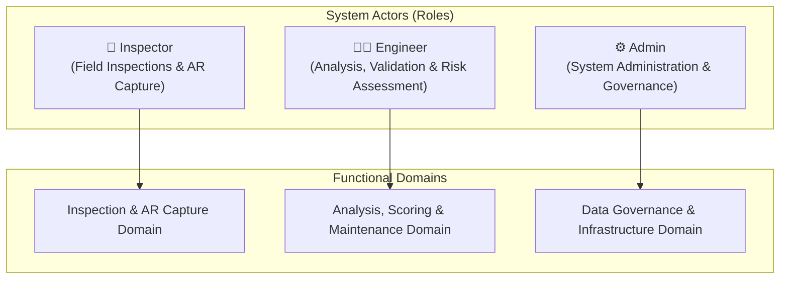
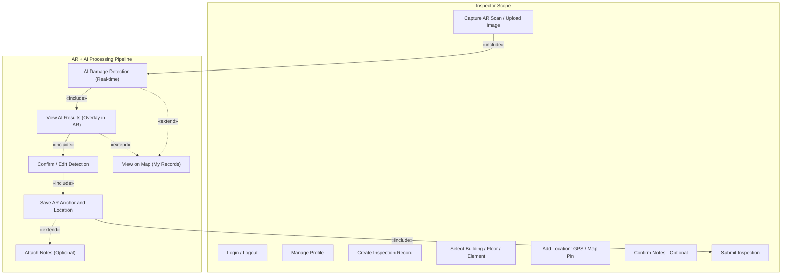
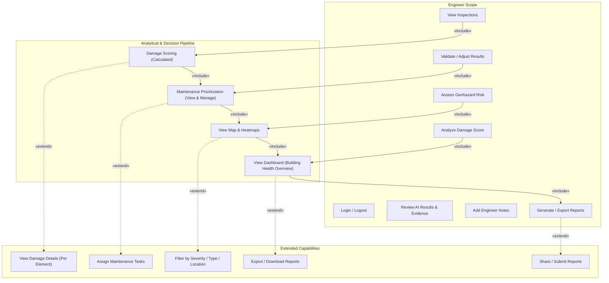
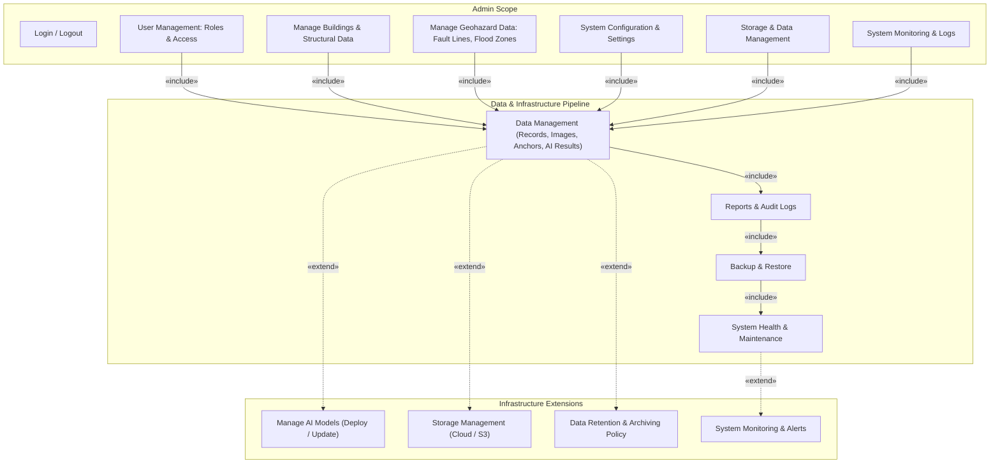

# ePropView System (WITH AR + AI) — User Access Definition

This document outlines the **User Access Definition** and **Role-Based Access Control (RBAC)** specifications derived from the **ePropView System (WITH AR + AI) Use Case Diagram**.

---

## 1. System Overview & Scope

**ePropView** is an integrated structural health assessment, augmented reality (AR) inspection, artificial intelligence (AI) damage detection, and GIS-based predictive maintenance platform. 

The system defines three core user roles (actors) with segregated responsibilities and operational workflows:
1. **Inspector** (Field Operations, AR/AI Capture, Record Ingestion)
2. **Engineer** (Engineering Review, AI Validation, Geohazard & Risk Assessment, Reporting)
3. **Admin** (System Governance, User/Role Management, Infrastructure, AI & Model Ops)

---

## 2. Actor Definitions & Profiles

### 2.1 Inspector (`inspector`)
* **Role Summary**: Performs on-site structural inspections using mobile / AR devices, captures visual and spatial data, reviews real-time AI damage predictions, and submits inspection records.
* **Primary Scope**:
  - Authenticate and manage personal profile.
  - Initiate and execute inspection workflows for designated buildings, floors, and structural elements.
  - Capture AR camera scans and photographic evidence.
  - Add spatial markers (GPS coordinates and interactive map pins).
  - Interact with real-time AI detection overlays and AR anchors.
  - Submit complete field inspection records into the repository.

---

### 2.2 Engineer (`engineer` / `reviewer`)
* **Role Summary**: Reviews, validates, and analyzes field inspection data, evaluates AI damage detections, assesses geohazard risks, calculates structural damage scores, prioritizes maintenance queues, and issues official engineering reports.
* **Primary Scope**:
  - Access, search, and review all submitted inspection records and visual evidence.
  - Validate, calibrate, or adjust AI damage classifications and severity levels.
  - Assess site and building geohazard exposures (fault lines, flood zones, soil conditions).
  - Analyze composite damage scores and building health indices.
  - Manage and rank maintenance queues with task delegation.
  - Compile, sign off, export, and distribute technical reports.

---

### 2.3 Admin (`admin`)
* **Role Summary**: Governs system access, user roles, core structural & geohazard datasets, cloud storage, AI model deployments, system configuration, audit logs, and maintenance operations.
* **Primary Scope**:
  - Complete user lifecycle and role-based access governance.
  - Building and structural hierarchy master data management.
  - Master dataset curation for geohazards (active fault lines, flood maps, liquefaction zones).
  - System-wide configuration and security policy settings.
  - Storage infrastructure (Cloud / S3 bucket management, backup/restore pipelines).
  - AI model registry and deployment lifecycle management.
  - System performance monitoring, audit log reviews, and health alerts.

---

## 3. Role-Based Access Control (RBAC) Matrix

| Functional Capability | Inspector | Engineer | Admin | Description |
| :--- | :---: | :---: | :---: | :--- |
| **Authentication & Profile** |
| `Login / Logout` | ✅ | ✅ | ✅ | Session authentication across mobile and web interfaces. |
| `Manage Profile` | ✅ | ✅ | ✅ | Update user profile, contact details, and credentials. |
| **Field Inspection & Capture** |
| `Create Inspection Record` | ✅ | ❌ | ❌ | Initiate a new inspection session for a building/structure. |
| `Select Building / Floor / Structural Element` | ✅ | 👁️ (Read) | ✏️ (Manage) | Browse hierarchy to assign target inspection element. |
| `Capture AR Scan` | ✅ | ❌ | ❌ | Run live ARCore / ARKit camera scan on physical elements. |
| `Upload Image` | ✅ | 👁️ (Read) | 👁️ (Read) | Upload static high-resolution photos and extract EXIF data. |
| `Add Location (GPS / Map Pin)` | ✅ | 👁️ (Read) | 👁️ (Read) | Tag inspection location via GPS hardware or manual pin. |
| `Confirm Notes (Optional)` | ✅ | ❌ | ❌ | Add initial field inspector annotations. |
| `Submit Inspection` | ✅ | ❌ | ❌ | Commit field inspection record to database and trigger pipeline. |
| **AI & AR Real-Time Processing** |
| `AI Damage Detection (Real-time)` | ⚡ (Trigger) | 👁️ (Review) | ⚙️ (Model Ops) | Run CV models (cracks, spalling, corrosion, deformation). |
| `View AI Results (Overlay in AR)` | ✅ | ❌ | ❌ | Visual AR overlay of bounding boxes and severity labels in situ. |
| `Confirm / Edit Detection` | ✅ | ❌ | ❌ | Quick field confirmation/adjustment of detected bounding boxes. |
| `Save AR Anchor and Location` | ✅ | ❌ | ❌ | Persist spatial SLAM anchor points to revisit physical defects. |
| `Attach Notes (Optional)` | ✅ | ❌ | ❌ | Attach localized annotations to specific AR anchors. |
| `View on Map (My Records)` | ✅ | ❌ | ❌ | View inspector's own assigned and submitted records on map. |
| **Engineering Analysis & Validation** |
| `View Inspections` | 👁️ (Own) | ✅ (All) | ✅ (All) | Access full archive of historical and pending inspection files. |
| `Review AI Results & Evidence` | ❌ | ✅ | 👁️ | In-depth examination of detection boxes, confidence, and imagery. |
| `Validate / Adjust Results` | ❌ | ✅ | ❌ | Expert override of AI classification, confidence, and severity. |
| `Assess Geohazard Risk (Site / Building)` | ❌ | ✅ | 👁️ | Correlate building coordinates with fault lines & flood zones. |
| `Analyze Damage Score` | ❌ | ✅ | 👁️ | Review calculated multi-factor structural damage scores. |
| `Damage Scoring (Calculated)` | ❌ | ✅ | 👁️ | Calculation engine factoring AI severity, importance & geohazard. |
| `View Damage Details (Per Element)` | ❌ | ✅ | 👁️ | Detailed breakdown of element-level defects and history. |
| `Add Engineer Notes` | ❌ | ✅ | ❌ | Technical engineering recommendations and assessment notes. |
| **Maintenance & Dashboard** |
| `Maintenance Prioritization (View & Manage)`| ❌ | ✅ | 👁️ | Prioritized queue of maintenance actions (Low, Med, High, Urgent). |
| `Assign Maintenance Tasks` | ❌ | ✅ | ❌ | Delegate work orders and maintenance tasks to teams. |
| `View Map & Heatmaps` | ❌ | ✅ | ✅ | GIS heatmap visualization of defect density and severity. |
| `Filter by Severity / Type / Location` | ❌ | ✅ | ✅ | Multi-attribute geospatial filtering. |
| `View Dashboard (Building Health Overview)` | ❌ | ✅ | ✅ | Aggregated KPI cards, health index, and risk distributions. |
| **Reporting & Export** |
| `Generate / Export Reports` | ❌ | ✅ | 👁️ | Compile inspection, AI, AR, and engineering data to PDF/DOCX. |
| `Export / Download Reports` | ❌ | ✅ | ✅ | Download generated report files. |
| `Share / Submit Reports` | ❌ | ✅ | ❌ | Transmit finalized reports to external stakeholders/authorities. |
| **System Administration & Ops** |
| `User Management (Roles & Access)` | ❌ | ❌ | ✅ | Provision users, assign roles (Inspector, Engineer, Admin). |
| `Manage Buildings & Structural Data` | ❌ | ❌ | ✅ | Master data CRUD for sites, buildings, floors, elements. |
| `Manage Geohazard Data` | ❌ | ❌ | ✅ | Ingest and update fault line, flood zone, and GIS shapefiles. |
| `System Configuration & Settings` | ❌ | ❌ | ✅ | Manage system variables, risk formula weights, and API keys. |
| `Storage & Data Management` | ❌ | ❌ | ✅ | Manage file buckets, attachments, thumbnails, and records. |
| `Storage Management (Cloud / S3)` | ❌ | ❌ | ✅ | Configure object storage, lifecycle policies, and S3 buckets. |
| `Data Retention & Archiving Policy` | ❌ | ❌ | ✅ | Define automated data purge and cold-storage retention rules. |
| `Manage AI Models (Deploy / Update)` | ❌ | ❌ | ✅ | Register, version, deploy, and benchmark CV/ML models. |
| `Reports & Audit Logs` | ❌ | ❌ | ✅ | Review tamper-evident activity logs and system audit trails. |
| `Backup & Restore` | ❌ | ❌ | ✅ | Trigger and schedule database and asset backups/restorations. |
| `System Health & Maintenance` | ❌ | ❌ | ✅ | Oversee system availability, database locks, and diagnostics. |
| `System Monitoring & Alerts` | ❌ | ❌ | ✅ | Monitor uptime, API latency, error rates, and automated alerts. |

*Legend: ✅ Full Access / Execute | 👁️ Read-Only Access | ✏️ Manage / Edit | ⚡ Trigger Pipeline | ❌ No Access / Forbidden*

---

## 4. Detailed Role Workflows & Use Case Relationships

### 4.1 Inspector Workflow (Field Operations)

#### Workflow Breakdown:
1. **Initiation**: Inspector logs in, selects building hierarchy (Building $\rightarrow$ Floor $\rightarrow$ Structural Element), and opens an inspection session.
2. **AR / Camera Capture**: The live camera feed captures the structure. 
3. **Real-Time AI Inference** (`«include»`): Computer vision models detect cracks, spalling, corrosion, and deformation.
4. **AR In-Situ Overlay** (`«include»`): The AR engine projects bounding boxes and severity color tags (Green/Yellow/Red) over physical surfaces.
5. **Field Verification** (`«include»`): Inspector confirms or adjusts detection bounding boxes.
6. **Spatial Anchoring** (`«include»`): Spatial coordinates and AR SLAM anchors are saved for persistent tracking.
7. **Extensions (`«extend»`)**:
   - `View on Map (My Records)`: Allows the inspector to visualize their assigned and captured pins on an on-device map.
   - `Attach Notes (Optional)`: Lets the inspector attach point-specific annotations to the spatial anchor.
8. **Submission**: The completed inspection record is submitted for engineering review.

---

### 4.2 Engineer Workflow (Analysis & Decision Support)

#### Workflow Breakdown:
1. **Inspection Ingestion & Review**: The Engineer opens submitted records and inspects high-resolution images, AR anchors, and AI detection metadata.
2. **Expert Calibration (`Validate / Adjust Results`)**: Adjusts false positives/negatives, recalibrating confidence and defect severity.
3. **Geohazard Integration (`Assess Geohazard Risk`)**: Queries GIS layers (active fault proximity, soil liquefaction, flood plains) to establish contextual environmental risk.
4. **Calculated Damage Scoring (`«include»`)**: Computes multi-factor health ratings:
   $$\text{Damage Score} = f(\text{AI Severity}, \text{Structural Importance Multiplier}, \text{Geohazard Factor})$$
5. **Maintenance Prioritization (`«include»`)**: Ranks defects into an action queue (`Low`, `Medium`, `High`, `Urgent`).
   - `«extend» Assign Maintenance Tasks`: Delegates repair actions and work orders to field maintenance teams.
6. **Geospatial & Dashboard Intelligence**:
   - `«include» View Map & Heatmaps` $\rightarrow$ `«extend» Filter by Severity / Type / Location`.
   - `«include» View Dashboard` $\rightarrow$ `«extend» Export / Download Reports`.
7. **Report Publication (`Generate / Export Reports`)**: Produces formal engineering deliverables $\rightarrow$ `«extend» Share / Submit Reports` to stakeholders and governing bodies.

---

### 4.3 Admin Workflow (Governance & System Infrastructure)

#### Workflow Breakdown:
1. **Identity & Access Governance (`User Management`)**: Provisions user accounts, assigns roles (`Inspector`, `Engineer`, `Admin`), and enforces authentication policies.
2. **Master Data Operations**: Manages structural assets (buildings, floors, columns, beams) and updates environmental GIS shapefiles (fault lines, flood hazard zones).
3. **Data Management & Pipeline Oversight (`«include»`)**:
   - Manages records, raw photos, AR point clouds, and AI inference outputs.
   - Enforces audit logging and compliance tracking (`Reports & Audit Logs`).
   - Executes database and object storage snapshot routines (`Backup & Restore`).
   - Performs health maintenance and system optimizations (`System Health & Maintenance`).
4. **Operations Extensions (`«extend»`)**:
   - `Manage AI Models (Deploy / Update)`: Deploys updated neural network weights (TensorFlow/PyTorch) and manages model registry.
   - `Storage Management (Cloud / S3)`: Configures cloud bucket lifecycle rules, encryption, and quotas.
   - `Data Retention & Archiving Policy`: Defines cold-storage policies and automated archival of historical inspections.
   - `System Monitoring & Alerts`: Tracks server CPU/memory, API endpoints, SLI/SLO metrics, and real-time failure alerts.

---

## 5. Security & Permission Boundaries

To ensure data integrity, separation of concerns, and regulatory compliance, the following hard security boundaries are enforced:

1. **Separation of Field & Engineering Roles**:
   - `Inspectors` cannot validate engineering outcomes, calculate official building damage scores, or publish final reports.
   - `Engineers` cannot fabricate raw camera feeds or spoof AR spatial anchors; they act upon submitted field evidence.
2. **Administrative Isolation**:
   - `Admins` have full structural, infrastructure, and user access, but cannot overwrite engineer verification notes or alter signed audit reports.
3. **Audit Trail Immutability**:
   - All AI inference raw results, inspector submissions, engineer adjustments, and administrative operations are recorded with timestamps, user IDs, and cryptographic hashes in the tamper-evident audit log.
4. **Data Protection & Storage Isolation**:
   - Images and AR spatial anchor data stored in cloud object storage (S3/Supabase Storage) are protected with signed URLs, role-based access policies, and encrypted at rest.
