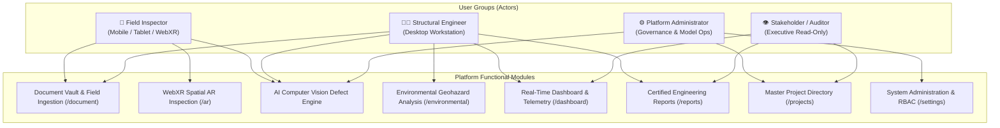

# EPROPVIEW System Operations Manual
## High-Level User Guide & Module Functional Specification

*Release Version 2.1.0 — Production & Capstone Comprehensive Operations Manual*

---

> [!NOTE]
> **Executive Purpose & Scope**  
> **EPROPVIEW** is an integrated structural health assessment, spatial Augmented Reality (AR) inspection, Artificial Intelligence (AI) defect telemetry, and GIS-based predictive maintenance platform. This document serves as the high-level user manual detailing operational procedures for each user group and expected functional outputs for every system module.

---

## 1. User Groups & Operational Workflows

The platform establishes four distinct user roles, ensuring strong separation of duties, operational efficiency, and regulatory compliance.

---

### 1.1 Field Inspector (`inspector`)
* **Persona & Device Profile:** On-site technical inspector operating mobile smartphones, tablets, or WebXR-enabled AR headsets.
* **Core Responsibilities:**
  1. **Structure Ingestion:** Navigate to **Document Vault (`/document`)** to initiate a new inspection record, selecting the target Building, Floor Level (Basement 2 to Roof Deck), and Structural Member (Beam, Column, Slab, Wall, Foundation, Façade, Roof).
  2. **Evidence Upload:** Capture high-resolution site photography with automatic camera EXIF metadata extraction.
  3. **Live AR Spatial Computing:** Launch **AR Mode (`/ar`)** on supported devices to track physical structural planes, place persistent 3D SLAM defect diamond anchors, and monitor camera XYZ coordinates.
  4. **In Situ AI Damage Scanning:** Trigger live computer vision inference within the AR viewfinder to automatically detect and anchor defects to physical surfaces.
* **Expected System Outputs for Inspectors:**
  * Real-time sync of uploaded images to cloud storage.
  * Interactive 3D spatial diamond markers hovering persistently over defect locations.
  * Preliminary AI damage classifications and confidence badges.

---

### 1.2 Structural Engineer (`engineer`)
* **Persona & Device Profile:** Professional Structural Engineer (PE/SE) or Technical Reviewer operating desktop workstations.
* **Core Responsibilities:**
  1. **AI Defect QA & Validation:** Review AI-generated bounding boxes in the **Document Vault (`/document`)**, fine-tune defect classifications, adjust severity ratings ($0–100$), and verify or reject false-positive predictions.
  2. **Multi-Factor Risk Scoring:** Automated calculation of the composite damage score based on base AI score, structural criticality multipliers (e.g., $1.2\times$ for load-bearing columns/beams), and geohazard exposure factors.
  3. **Geohazard Analysis:** Evaluate regional GIS seismic fault line buffers, soil liquefaction risk zones (Zone A/B/C), and erosion vulnerability in **Environmental View (`/environmental`)**.
  4. **Maintenance Queue Governance:** Evaluate and manage ranked structural work tickets on the **Dashboard (`/dashboard`)**, assigning designated repair contractors, establishing due dates, and issuing engineering directives.
  5. **Report Sign-Off & Certification:** Compile multi-source data in **Reports (`/reports`)**, conduct peer reviews, and certify formal printable inspection reports.
* **Expected System Outputs for Engineers:**
  * Automated update of parent inspection risk scores ($1–10$) and risk levels (Low, Moderate, High, Critical) upon defect verification.
  * Automatic generation of priority work orders for critical defects.
  * Complete audit trail recording engineer verification identity and timestamp.

---

### 1.3 Platform Administrator (`admin`)
* **Persona & Device Profile:** IT Systems Officer or Chief Engineering Administrator.
* **Core Responsibilities:**
  1. **User Provisioning & RBAC:** Provision new accounts with custom roles (`inspector`, `engineer`, `admin`, `viewer`) in **Settings (`/settings`)** and manage account activation/deactivation.
  2. **AI Model Registry:** Deploy new neural network weights (YOLOv8, ResNet50), toggle active/standby model checkpoints, and register new defect class labels.
  3. **Master Infrastructure:** Oversee building projects, PostGIS geohazard polygon shapefiles, and cloud storage bucket configurations.
* **Expected System Outputs for Administrators:**
  * Instant role-based permission enforcement across all endpoints.
  * Seamless zero-downtime model deployments across active inspection pipelines.

---

### 1.4 Viewer / Stakeholder (`viewer`)
* **Persona:** Property owners, executive stakeholders, insurance assessors, and regulatory auditors.
* **Core Responsibilities:** Read-only review of public building health dashboards, risk heatmaps, and finalized PDF/printable reports without editing capabilities.

---

## 2. Comprehensive Module Functional Specifications

### 2.1 Real-Time Dashboard & Telemetry Overview (`/dashboard`)
* **Live KPI Metric Cards:** Real-time metrics for *Active Projects*, *Critical Risk Reports*, *Reports in Review*, and *Completed Repairs*.
* **Geospatial Mapbox v3.x Interface:** Renders PostGIS geohazard polygons (Zone A Red, Zone B Amber, Zone C Emerald) with frame-by-frame camera animation avoiding tile-loading blank-out bugs.
* **Damage Severity Trend Chart:** Chart.js multi-dataset trend line tracking monthly defect progression and real-time AI telemetry counts.
* **Sector Hotspots & Telemetry Grid:** 2D spatial coordinate map plotting sector hotspots, AR spatial anchors, and AI defect points with rich hover tooltips.
* **Maintenance Prioritization Queue:** Ranked repair work tickets displaying location, risk score, status chip, assignee, and task creation/management modal.

### 2.2 Active Projects Master Directory (`/projects`)
* **Project Cards:** High-level overview of active sites with status badges (Active Monitoring, Archived Complete, Suspended).
* **Site Telemetry Indicators:** Total Inspections, Total Reports, Critical Alert Count, and Last Telemetry Timestamp.
* **Assigned Team Badges:** Color-coded roster chips showcasing assigned structural engineers, inspectors, and administrators.

### 2.3 Document Vault & Asset Telemetry (`/document`)
* **Inspection Registration:** Comprehensive form specifying Project, Date, Location, Floor Level (B2 to Roof), and Structural Element (Beam, Column, Slab, Wall, Foundation, Façade, Roof).
* **Asset Feed with Skeleton Loading:** Smooth progressive image grid with element tags and capture timestamps.
* **Real-Time Commenting Thread:** Social commenting system allowing engineers and inspectors to exchange timestamped repair directives on specific photos.

### 2.4 AI Damage Detection & Severity Scoring Engine
* **5 Structural Failure Modes:** Automated detection of Cracking, Corrosion/Rusting, Concrete Spalling, Structural Deformation, and Water Leakage.
* **Bounding Box Telemetry:** Normalized defect localization $[x, y, w, h]$ with confidence percentages ($0–100\%$).
* **Weighted Damage Formula:** 
  $$\text{Final Damage Score} = \min(10.0, \text{Base Score} \times \text{Structural Multiplier} \times \text{Geohazard Factor} \times \text{Recency Factor})$$
* **Validation Controls:** Engineer actions for `[Verify Detection]`, `[Adjust Severity]`, and `[Reject / False Positive]`.

### 2.5 Augmented Reality (AR) Spatial Inspection Module (`/ar`)
* **WebXR Canvas Binding:** Immersive AR camera session binding WebGL contexts to device passthrough feeds.
* **Surface Reticle & HUD:** Dynamic reticle snapping to physical planes with live HUD telemetry (FPS, camera XYZ pose, anchor counter).
* **Tap-to-Anchor SLAM Persistence:** Single-tap spatial anchoring saving 3D coordinate poses, damage classification, and field notes to the database.
* **In Situ AI Auto-Detection:** Live inference directly inside the AR camera view.

### 2.6 Environmental Geohazard Analysis (`/environmental`)
* **Fault Line Proximity Buffer:** Seismic fault line proximity evaluation (None, Low, Moderate, High, Very High).
* **Soil Liquefaction Zoning:** Foundation stability categorisation (Zone A High Risk, Zone B Moderate, Zone C Stable Ground).
* **Erosion Potential Modeling:** Runoff and slope stability index (Severe, Moderate, Low, Negligible).

### 2.7 Certified Engineering Reports & Deliverables (`/reports`)
* **Compilation Wizard:** Aggregates inspections, AI defect summaries, AR spatial anchors, and geohazard ratings into formal reports.
* **Audit Sign-off Trail:** Tracks Lead Inspector, Created By, Certified Reviewer, and Last Edited metadata.
* **Print-Ready Layout:** Clean, executive-styled printable documents suitable for client presentation and regulatory submission.

### 2.8 System Settings & Master Data Governance (`/settings`)
* **User Provisioning:** Create authorized personnel with email, password, full name, department, and assigned role.
* **Live User Directory:** Immediate account activation/deactivation toggles and role elevation controls.
* **AI Model Registry v2:** Version tracking, network architecture (`yolov8`, `resnet50`), input tensor dimensions, confidence/IoU threshold calibration, label configuration, and model activation controls.
* **Building Master Registry:** Register multi-building complexes per project, set structural codes, and specify precise geographic coordinates.
* **Floor Level Hierarchy:** Define vertical floor levels with interactive reordering and elevation indexing.
* **Structural Element Catalog:** Maintain structural elements by member type (`column`, `beam`, `slab`, `shear wall`), add individual members, or bulk import schedules via CSV.
* **Geohazard GIS Layer Management:** Upload regional GeoJSON or ESRI Shapefile datasets (fault line traces, liquefaction zones, flood boundaries) and toggle map layer visibility.
* **Storage Bucket Lifecycle & S3 Manager:** Audit storage volume across buckets, track cold/glacier/archive tiers, run automated 1-year archival lifecycle policies, and clean orphaned assets.

---

## 3. Role-Based Access Control (RBAC) Matrix

| Functional Capability | Inspector | Engineer | Admin | Viewer |
| :--- | :---: | :---: | :---: | :---: |
| **Login & Profile Management** | Full | Full | Full | Full |
| **Create Inspection & Select Structural Element** | Full | Read Only | Manage | Read Only |
| **Upload Inspection Photos & EXIF** | Full | Read Only | Read Only | Read Only |
| **Execute AR Camera Scan & Reticle** | Full | None | None | None |
| **Place & Save 3D Spatial Anchors** | Full | Read Only | Read Only | Read Only |
| **Native ARKit / ARCore Mobile Session** | Full | None | None | None |
| **Trigger In Situ AI Inference** | Full | Read Only | Model Ops | None |
| **Validate / Override AI Damage Scores** | None | Full | Read Only | None |
| **Reject False Positive Detections** | None | Full | None | None |
| **Environmental Geohazard Analysis** | Read Only | Full | Manage | Read Only |
| **Auto-Calculate Risk from GIS Layers** | None | Full | Full | None |
| **Assign Maintenance Work Tickets** | None | Full | Manage | None |
| **Compile & Sign Off Reports** | None | Full | Read Only | None |
| **Print / Export Formal Reports** | Read Only | Full | Full | Read Only |
| **User Provisioning & Role Elevation** | None | None | Full | None |
| **Deploy & Toggle AI Model Weights** | None | None | Full | None |
| **Manage Buildings & Structural Master Data** | Read Only | Read Only | Full | Read Only |
| **Import GeoJSON & Shapefile GIS Datasets** | None | None | Full | None |
| **Storage Lifecycle & S3 Archival Governance** | None | None | Full | None |

---

## 4. Pre-Seeded Accounts for System Evaluation

| Personnel Name | Login Email | Initial Password | Assigned Role |
| :--- | :--- | :--- | :--- |
| **System Administrator** | `admin@eprop.local` | `AdminPassword123!` | `ADMIN` (Platform Governance & Model Ops) |
| **Engr. Sarah Jenkins, PE** | `engineer@eprop.local` | `EngineerPassword123!` | `ENGINEER` (Lead Structural Risk QA) |
| **Engr. David Chen, SE** | `reviewer.engineer@eprop.local` | `EngineerPassword123!` | `ENGINEER` (Engineering Validation & Review) |
| **Alex Rivera** | `inspector@eprop.local` | `InspectorPassword123!` | `INSPECTOR` (Field Operations & AR Capture) |

---

### Artifact Reference
* **Word Document (`.docx`)**: [`docs/user_operations_guide.docx`](file:///home/javvii/FreelanceProject/Project5/EPROPVIEW/docs/user_operations_guide.docx)
* **Markdown Document (`.md`)**: [`docs/user_operations_guide.md`](file:///home/javvii/FreelanceProject/Project5/EPROPVIEW/docs/user_operations_guide.md)
